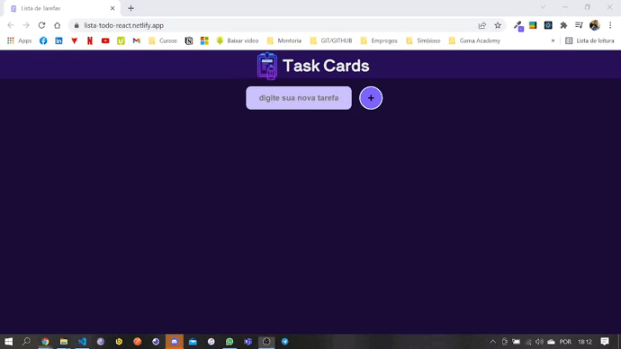

<h1 align="center">
  
</h1>

<h2 align="center" >Descrição do Projeto</h2>
<p align="center">
 Task Cards é um Lista de tarefas em forma de Cards, aonde voce podera organizar todas as tarefas do seu dia.

</p>

<h1 align="center">
  
</h1>

## 🔎 Features

- [x] Cadastro das tarefas.
- [x] Exclusão das tarefas.
- [x] Alteração do nome das tarefas.
- [x] Marcar cada card de tarefa como feito quando a tarefa ja estiver sido realizada.
- [x] Caso card de tarefa esteja habilitado para edição, não deixar o mesmo ser marcado como feito.
- [x] Caso card de tarefa ja esteja marcado como feito, não deixar ser editado.


## :rocket: Tecnologias

Esse projeto foi desenvolvido com as seguintes tecnologias:

✔️ React

✔️ JavaScript

✔️ CSS

✔️ React-Toastify

✔️ React-hooks

✔️ Axios


<h2>Pré-requisitos</h2>

Antes de começar, você vai precisar ter instalado em sua máquina as seguintes ferramentas:
[Git](https://git-scm.com) e [Node](https://nodejs.org/pt-br/).
Além disto é bom ter um editor para trabalhar com o código como [VSCode](https://code.visualstudio.com/).

## 🔗 Link da aplicação no ar: https://lista-todo-react.netlify.app/

# 👨‍💻 Rodando o Front End

```bash
# Clone este repositório
$ git clone https://github.com/gabriel-assana/TaskCards-React
# Acesse a pasta do projeto no terminal/cmd
$ cd TaskCards-React
# Abra um novo terminal e execute a aplicação em modo de desenvolvimento
$ yarn start
# O servidor do front-end inciará na porta:http://localhost:3000/ - acesse <http://localhost:3000/>
